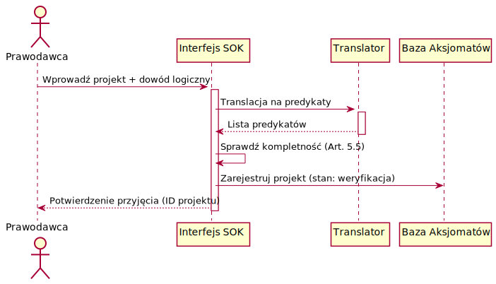
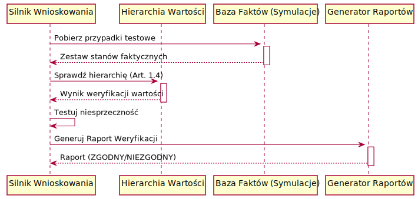
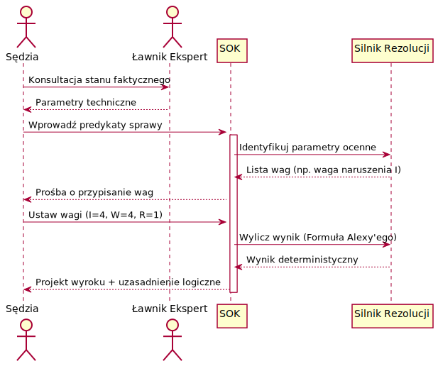

# Dokumentacja Funkcjonalna Systemu Ochrony Konstytucji (SOK)

## 1. Szkic Przypadków Użycia (Use Cases)

| Nazwa | Aktorzy | Główny scenariusz powodzenia (skrót) |
| :--- | :--- | :--- |
| **UC01: Zgłoszenie projektu ustawy** | Prawodawca (Poseł, Rząd) | Prawodawca wprowadza projekt i dowód logiczny; SOK weryfikuje formalnie. |
| **UC02: Weryfikacja spójności (CI/CD Prawa)** | SOK, Inicjator projektu | System przeprowadza testy spójności i zgodności z hierarchią wartości; generuje raport. |
| **UC03: Orzekanie w sprawie łatwej** | SOK, Obywatel, (Sędzia - nadzór) | System automatycznie wylicza wyrok na podstawie bezspornych faktów i predykatów. |
| **UC04: Orzekanie w sprawie trudnej** | Sędzia, SOK, Ławnicy eksperci | Sędzia ustala fakty i przypisuje wagi parametrom; SOK wylicza wynik deterministycznie. |
| **UC05: Rozstrzyganie kolizji przez referendum** | Obywatel, Prezydent, Prezes SN | W przypadku patu aksjologicznego Naród rozstrzyga o pierwszeństwie wartości. |
| **UC06: Symulacja skutków prawnych** | Obywatel | Obywatel testuje wpływ planowanych działań lub zmian w prawie na swoją sytuację. |
| **UC07: Audyt logiczny prawa (Open Source)** | Obywatel, Organizacja NGO, SOK | Publiczna weryfikacja kodu i logiki systemu przez podmioty zewnętrzne. |

---

## 2. Szczegółowe opisy Przypadków Użycia

### 2.1 UC01: Zgłoszenie projektu ustawy

**Opis:** Inicjator legislacyjny wprowadza nowy akt prawny do systemu w celu jego weryfikacji i ewentualnego uchwalenia.
**Warunki wstępne:** Posiadanie uprawnień inicjatywy ustawodawczej, przygotowany projekt w języku naturalnym.

**Główny scenariusz powodzenia:**
1. Prawodawca przygotowuje projekt ustawy wraz z "sformalizowanym dowodem logicznym" (art. 4.2).
2. Prawodawca wprowadza projekt do interfejsu SOK.
3. System dokonuje wstępnej translacji na predykaty (wspomaganej przez AI/Ekspertów).
4. System sprawdza kompletność (podmiot, warunek, skutek - art. 5.5).
5. System przyjmuje projekt do pełnej weryfikacji (UC02).

**Wyjątki:**
- **E1: Brak dowodu logicznego** – SOK zawiesza procedurę do czasu uzupełnienia.
- **E2: Niepełność przepisu** – Brak określonego skutku lub podmiotu powoduje odrzucenie formalne.

### 2.2 UC02: Weryfikacja spójności (CI/CD Prawa)

**Opis:** Automatyczny proces testowania projektu pod kątem logicznym i aksjologicznym.
**Warunki wstępne:** Projekt przyjęty do weryfikacji (UC01).

**Główny scenariusz powodzenia:**
1. SOK uruchamia testy spójności wewnętrznej (brak sprzeczności P ∧ ¬P).
2. SOK przeprowadza test zgodności z hierarchią wartości (art. 1.4).
3. SOK wykonuje testy symulacyjne na historycznych i losowych stanach faktycznych.
4. SOK generuje Raport Weryfikacji z wynikiem "ZGODNY".
5. Projekt zostaje oznaczony jako gotowy do głosowania.

**Wyjątki:**
- **E1: Kolizja z wartością wyższą (np. Godność)** – Niezgodność bezwzględna, projekt odrzucony.
- **E2: Sprzeczność logiczna** – Raport wskazuje sprzeczne przepisy, projekt wraca do poprawy.

### 2.3 UC04: Orzekanie w sprawie trudnej

**Opis:** Proces sądowy, w którym sędzia przy wsparciu ławników ustala parametry ocenne, a SOK wylicza wyrok.
**Warunki wstępne:** Sprawa zakwalifikowana jako "trudna" (brak bezspornego sylogizmu).

**Główny scenariusz powodzenia:**
1. Sędzia i ławnicy eksperci ustalają stan faktyczny.
2. Sędzia wprowadza opis sprawy za pomocą predykatów do SOK.
3. System identyfikuje "luzy decyzyjne" (parametry/wagi, np. stopień winy 1-10).
4. Sędzia przypisuje wartości wybranym parametrom na podstawie oceny moralnej.
5. SOK stosuje reguły (np. Formuła Wagi Alexy'ego) i generuje wyrok.
6. Sędzia zatwierdza wyrok i generuje uzasadnienie (ścieżka logiczna).

**Wyjątki:**
- **E1: Pat aksjologiczny** – Wartości na tym samym poziomie dają wynik równy. Wymagana interwencja wyższej instancji lub referendum.
- **E2: Falsyfikacja skutku** – System ostrzega, że wybrany parametr prowadzi do skutku sprzecznego z celem ustawy.

### 2.4 UC05: Rozstrzyganie kolizji przez referendum

**Opis:** Naród decyduje o pierwszeństwie wartości w sytuacji, gdy organy państwa nie osiągnęły konsensusu.
**Warunki wstępne:** Pat w interpretacji między Prezydentem a Prezesem SN (art. 5.2.1).

**Główny scenariusz powodzenia:**
1. SOK wykrywa kolizję wartości niemożliwą do rozstrzygnięcia przez hierarchię (ten sam poziom).
2. Prezydent i Prezes SN przedstawiają odmienne stanowiska.
3. Prezydent zarządza referendum.
4. Obywatele głosują nad pierwszeństwem jednej z wartości (karta referendalna).
5. Wynik referendum (przy frekwencji >50%) zostaje wprowadzony do SOK jako nowa reguła priorytetu dla danej sprawy.

**Wyjątki:**
- **E1: Niska frekwencja** – Referendum niewiążące, pat trwa, akt nie wchodzi w życie.

---

## 3. Persony do testowania

| Persona | Profil | Rola w systemie |
| :--- | :--- | :--- |
| **Mecenas Janusz** | Doświadczony adwokat starej daty, przywiązany do retoryki. | Próbuje znaleźć "luki" w predykatach, podważa "mechaniczne" wyroki. |
| **Sędzia Anna** | Sędzia I instancji, ceniąca precyzję, ale obawiająca się o sumienie. | Testuje proces przypisywania wag i weryfikację instancyjną (UC04). |
| **Poseł Marek** | Energiczny polityk, chce szybko uchwalać ustawy. | Próbuje ominąć testy SOK (UC01/UC02), testuje procedurę poprawy aktu. |
| **Obywatelka Ewa** | Świadoma obywatelka, dba o swoje prawa i transparentność. | Korzysta z symulatora (UC06), audytuje kod (UC07), głosuje w referendum (UC05). |
| **Inżynier Piotr** | Ekspert z Instytutu Utrzymania Systemu. | Odpowiada za "karmienie" systemu predykatami i audyt techniczny (UC07). |

---

## 4. Scenariusze testowe

### T01: Test "Prawa do błędu" (Persona: Poseł Marek)
- **Cel:** Sprawdzenie, czy system wykryje próbę wprowadzenia przepisu sprzecznego z Godnością Osoby (Indeks 1).
- **Przebieg:** Marek zgłasza ustawę o "przymusowej pracy dla dobra wspólnoty" bez wynagrodzenia.
- **Oczekiwany wynik:** UC02 kończy się Raportem "NIEZGODNOŚĆ BEZWZGLĘDNA". Blokada dalszego procedowania.

### T02: Test "Luzy decyzyjne" (Persona: Sędzia Anna)
- **Cel:** Weryfikacja, czy sędzia może wydać wyrok sprzeczny z wyliczonym wynikiem po ustawieniu wag.
- **Przebieg:** Anna ustawia wagi Alexy'ego dające wynik 0.25 (przewaga ochrony dóbr), ale próbuje ręcznie zmienić konkluzję na "uniewinnienie" ze względu na sympatię do oskarżonego.
- **Oczekiwany wynik:** System SOK blokuje zatwierdzenie wyroku i flaguje "Błąd logiczny sędziego" (art. 5.7.2).

### T03: Test "Przejrzystość dla obywatela" (Persona: Obywatelka Ewa)
- **Cel:** Sprawdzenie, czy uzasadnienie wyroku jest zrozumiałe dla osoby bez wykształcenia prawniczego.
- **Przebieg:** Ewa uruchamia podgląd wyroku w swojej sprawie.
- **Oczekiwany wynik:** System generuje graficzną ścieżkę od predykatów faktów, przez zastosowane przepisy, aż do konkluzji, z wyjaśnieniem każdego kroku w języku naturalnym.

### T04: Test "Audyt Społeczny" (Persona: Inżynier Piotr, NGO)
- **Cel:** Weryfikacja, czy zmiana w silniku wnioskowania (kod Pythona) zostanie wykryta przez społeczność.
- **Przebieg:** Administrator próbuje cicho zmienić priorytet "Własności" nad "Godność" w bazie aksjomatów.
- **Oczekiwany wynik:** System weryfikacji konsensusu (Shadow Deployment) wykrywa zmianę sum kontrolnych, NGO alarmuje o naruszeniu integralności.
