# Strategia wdrożenia

Ten dokument opisuje strategię wdrożenia projektu, w tym projekt nowej Konstytucji jako punkt wyjścia oraz szczegółowy plan implementacji technicznej i organizacyjnej, z uwzględnieniem roli Rady Programowej.

## 1. Warunki powodzenia

### 1.1. Odpowiedzialność

Zanim zostanie przedstawiony harmonogram wdrożenia, należy odpowiedzieć na pytanie fundamentalne: jakie są warunki pomyślnego wdrożenia takiego systemu? Historia transformacji cyfrowych w administracji publicznej zna wiele porażek. Nie można dopuścić do tego, aby takie zagrożenie dotyczyło automatyzacji prawa. Dlatego konieczne jest określenie warunków brzegowych, bez których nawet najlepszy projekt pozostanie martwym dokumentem.

Odpowiedzią na pytanie o to, czego potrzebujemy najbardziej jest:

**Potrzeba odpowiedzialności.**

Nie chodzi tylko o to, że ktoś podejmie decyzję i weźmie na siebie odpowiedzialność. Taka odpowiedzialność może wynikać z odwagi, nieświadomości lub determinacji. Dla tak ambitnego projektu potrzebujemy odwagi zbudowanej na kompetencjach (*wiem jak to zrobić, dlatego z pełną odpowiedzialnością tego się podejmuję*). Oczywiście nie ma człowieka, który mógłby samodzielnie przeprowadzić takie wdrożenie. Dlatego mówimy o kompetencjach i odpowiedzialności całego zespołu gromadzonego wokół lidera lub liderów politycznych.

Każdy z członków zespołu powinien mieć kompetencje odpowiednie do realizowanych zadań. Jedną z takich fundamentalnych kompetencji - niezależnych od rodzaju zadań - jest poczucie odpowiedzialności. Całość spaja **zaufanie**. Szef każdego zespołu musi mieć zaufanie do ludzi, którymi kieruje, i samemu zadbać o budowanie zaufania do zespołu jako całości.

Tym samym terminem „zaufanie\" określamy ufność do skuteczności stosowanych procedur, technologii i metodologii. Dopiero w oparciu o tak zbudowaną odpowiedzialność i zaufanie można podjąć decyzję o rozpoczęciu wdrożenia. Zaufanie jednak nigdy nie jest bezgraniczne. Dlatego tak istotne są dwa komponenty rozwoju:

-   **zarządzanie ryzykiem** - systematyczna identyfikacja i mitygacja zagrożeń na każdym etapie;

-   **metodyki zwinne** (Agile, Scrum, ciągła integracja) -  umożliwiające stałe testowanie kolejnych wersji rosnącego systemu.

Nie chodzi jednak tylko o testy techniczne. Każda wersja SOK powinna być udostępniana do dobrowolnych testów przez obywateli, organizacje pozarządowe i środowiska akademickie. Im wcześniej system wyjdzie poza krąg „wtajemniczonych", tym szybciej zostaną wykryte błędy - zarówno programistyczne, logiczne, jak i aksjologiczne.

Zaufanie do systemu nie może opierać się wyłącznie na zaufaniu do osób. Potrzebna jest instytucjonalna niezależność audytu. Żaden zespół odpowiedzialny za budowę SOK nie może być jedynym podmiotem weryfikującym jego poprawność. Konieczne jest powołanie niezależnej **Rady Naukowej**, złożonej z ekspertów spoza zespołu wdrożeniowego, której zadaniem będzie recenzowanie kluczowych decyzji architektonicznych i aksjologicznych. Tylko wtedy obywatele będą mogli uwierzyć, że system nie jest „ukrytą maszyną władzy".

Na początku, gdy jest on rozwijany jako *open source*,zarządzaniem projektem z uwzględnieniem opisanych wyżej zasad dba fundacja Galicea jako lider instytucjonalny w tej fazie projektu (faza 0).

Warunkiem powodzenia jest również realistyczne oszacowanie kosztów i czasu, zakotwiczone w kalendarzu wyborczym (szczegóły w sekcji 7). To nie jest projekt na „jedną kadencję\". Potrzebna jest zgoda ponadpartyjna lub - w przypadku jej braku - mechanizm kontynuacji niezależny od cyklu wyborczego.

## 2. Struktura projektu

### 2.1. Strategia open source jako oś wdrożenia

Osią całego procesu wdrożenia Systemu Ochrony Konstytucji (SOK) jest strategia open source. Open source w tym projekcie to nie tylko argument wizerunkowy przeciwko „czarnym skrzynkom\", ale **główny mechanizm przyspieszenia i walidacji**.

Przyjęcie modelu, w którym projekt Konstytucji i SOK są publicznie rozwijane (na GitHubie), diametralnie zmienia reguły gry:
-   Formalizacja aksjologii i reguł może rozpocząć się **natychmiast**, bez czekania na formalne decyzje polityczne.

-   Prototyp silnika wnioskowania może być budowany i testowany publicznie przez społeczność specjalistów.

-   Pierwsza weryfikacja Konstytucji przez SOK staje się publiczną demonstracją technologii i buduje wiarygodność przed wyborami 2027.

Zaufanie do procedur i technologii wymaga pełnej transparentności. Kod źródłowy SOK musi być w pełni publiczny (open source). Tajny kod to „czarna skrzynka\", a czarna skrzynka w państwie prawa jest niedopuszczalna (art. 4.12.1 projektowanej Konstytucji).

### 2.2. Fundacja jako lider instytucjonalny fazy 0

Projekt open source bez podmiotu prawnego to zbiór niezobowiązujących plików. Fundacja prawa prywatnego, powołana na potrzeby projektu, rozwiązuje cztery problemy strukturalne:

|  Problem               | Rozwiązanie przez fundację |
|------------------------|--------------------------- |
|  Własność intelektualna |   Na Github jest publikowana licencja zapewniająca pełną otwartość. Przystąpienie do projektu oznacza jej akceptację. Fundacja  zapewnia utrzymanie kopii projektu, aby nie był zależny od GitHub. Fundacja pozostaje właścicielem serwerów oraz oprogramowania otwartego, używanych w projekcie. Jednak z uwagi na zwinny i otwarty sposób rozwoju i nie są to zasoby w jakikolwiek sposób uzależniający projekt od fundacji.|
|Zdolność do czynności prawnych | Może przyjmować granty, zawierać umowy, posiadać domeny i konta.|
| Ciągłość projektu |Działa niezależnie od wyniku wyborów i składu rządu.|
| Wiarygodność wobec decydentów | Raport fundacji do Sejmu ma inną wagę niż sam „projekt na GitHubie\"|

### 2.3. Zrównoleglenie prac: podejście wielowątkowe

Dzięki podejściu open source proces wdrożenia rezygnuje z tradycyjnej sekwencyjności na rzecz równoległego rozwoju wątków. Wątki A, B i D
startują **od dnia zero**; wątek C (legislacja) wymaga działającego MVP silnika i uruchamia się po 4-5 miesiącach.

|  Wątek |Działania  | Start|
|------|-----------------|---|
|**A** - SOK open source|  Budowa silnika rezolucji w Pythonie; pola semantyczne; testy jednostkowe; CI/CD na GitHubie |   Dzień 0|
|**B** - Formalizacja|Przekład projektu Konstytucji na predykaty; jawna recenzja przez środowiska  prawniczo-logiczne |    Dzień 0|
|**C** - Legislacja |Przygotowanie projektów ustaw konstytucyjnych w oparciu o działające moduły SOK |Miesiąc 5|
|**D** - Społeczność|Ciągły audyt i recenzje NGO, uczelni i ekspertów niezależnych w modelu publicznym| Dzień 0|

## 3. Zasoby

### 3.1. Minimalne i optymalne zasoby

Model open source radykalnie zmienia strukturę kosztów, umożliwiając start projektu w trybie „bootstrap\" przez fundację.

#### Wariant minimalny (open source-first, fundacja + wolontariat)

Rdzeń tworzy niewielki zespół opłacany z pierwszych grantów lub zbiórek;
resztę pracy wykonuje społeczność kontrybutorów:

|  Rola      |    Liczba |  Uwagi |
|------------|-----------|--------|
|Koordynator projektu / lider | 1  | Zarząd fundacji, kontakty zewnętrzne|
|Programiści Python (silnik rezolucji + pola semantyczne)                  |2-3 |Kluczowa kompetencja techniczna|
| Teoretycy prawa / logicy prawniczy| 1-2 | Translacja przepisów,aksjologia|
|Legislator | 1 | Projekty ustaw konstytucyjnych|
| DevOps   | 1 | GitHub, CI/CD, dokumentacja,panel audytowy |
| Rada Naukowa (zewnętrzna, niezależna) |   5-7 |  Wolontariat; 4  posiedzenia/rok|
  
  
**Łącznie rdzeń płatny: 6-8 osób.** Szacunkowy koszt: 250-400 tys.PLN/rok (wynagrodzenia + infrastruktura). Wszystkie narzędzia (Python, FastAPI, pytest, PostgreSQL, GitHub Actions) są bezpłatne i open source.

Krytyczne wąskie gardło: programiści znający jednocześnie logikę deontyczną i Python. Fundacja powinna uruchomić otwarty nabór skierowany do środowisk akademickich (informatyka, logika, prawo formalne). Terminy i dynamika rozwoju uzależnionei są od uzyskania funduszy. Fundacja ze środków własnych może pokryć koszty startowe.
Dalszy rozwój zespołu jest zależny od pozyskania funduszy. W razie problemów, może zostać uruchomiona alternatywna strategia rozwoju, w oparciu o „Laboratorium Cyfryzacji", które stanowi odrębny projekt rozwijany przez fundację. Decyzja o wyborze strategii zapadnie 2-3 miesiące po zainicjowaniu projektu.

#### Wariant optymalny (finansowanie grantowe lub instytucjonalne)

Przy pozyskaniu budżetu celowego (grant UE, środki rządowe, fundacje prywatne) możliwe jest  zbudowanie pełnego, profesjonalnego zespołu ok. 25-30 osób, obejmującego pełny zespół aksjologiczny, inżynierii oprogramowania i dedykowaną Radę Naukową. W tym wariancie czas do MVP wynosi 4-6 miesięcy. Należy wziąć pod uwagę to, że większy zespół wymaga większego zaangażowania sił i środków w zarządzanie przedsięwzięciem - dlatego przyspieszenie nie jest proporcjonalne do skali finansowania. Rozwój zespołu to przy dobrym zarządzaniu wzrost kompetencji, zaufania i bezpieczeństwa.

## 4. Etapy realizacji (Kamienie Milowe)

### 4.1. Testowanie na istniejącym prawie (Proof of Concept)

Zanim SOK zweryfikuje projekt Konstytucji, musi udowodnić swoją skuteczność na **prostych, obowiązujących przepisach**. Tylko w tym przypadku wynik jest znany z góry i pozwala ocenić poprawność silnika. Dlatego w miesiącach 3-5 fazy 0 przeprowadzona zostanie walidacja. Wstępnie zakładamy, że będzie ona realizowana na:
-   **Ustawie o waloryzacji emerytur i rent** - czysto sylogistyczna struktura, mierzalne warunki, brak pojęć nieostrych.
-   **Ustawie o odsetkach ustawowych** - jednoznaczne reguły, proste skutki prawne.
-   Wybranych przepisach **ordynacji podatkowej** dotyczących prostych obowiązków sprawozdawczych.

Raport z PoC jest publikowany jako dokument open source z opisem: co SOK zaakceptował, co  zakategoryzował jako „wymaga sędziego\" i jaki był ślad wnioskowania dla każdego przepisu. Dopiero po publicznej walidacji PoC SOK przystępuje do weryfikacji projektu Konstytucji

## 4.2. Harmonogram wdrożenia dostosowany do kalendarza wyborczego

Harmonogram jest zakotwiczony w polskim kalendarzu politycznym. Punkty odniesienia:

-   **Wybory parlamentarne: jesień 2027** - przed wyborami SOK musi działać demonstracyjnie na istniejącym prawie.

-   **Nowa kadencja Sejmu: styczeń 2028** - nowy Sejm uchwala ustawy konstytucyjne.

-   **Wybory prezydenckie: 2030** - referendum konstytucyjne połączone z wyborami gwarantuje frekwencję ≥ 50%.

Oto tabele z pliku przekształcone na format Markdown:

 
#### Tabela 1. Harmonogram wdrożenia SOK i nowej Konstytucji (2026–2030+)

| Etap | Ramy czasowe | Wątki równoległe | Kluczowe kamienie milowe |
|------|--------------|------------------|---------------------------|
| **ETAP 0 – Start i Proof of Concept** | Dziś – jesień 2027 | A: silnik rezolucji Python na GitHubie; B: formalizacja Konstytucji; D: audyt społeczny | M0: fundacja → repozytorium; M3–4: PoC na istniejących ustawach + raport publiczny; M5–9: weryfikacja projektu Konstytucji; jesień 2027: prezentacja dla decydentów |
| **ETAP 1 – Nowa kadencja i legislacja** | Jesień 2027 – 2029 | A: logika deontyczna, wyjątki, testy regresyjne; B: aktualizacja predykatów; C: 5 ustaw konstytucyjnych; D: audyt społeczny | Styczeń 2028: nowy Sejm przyjmuje mechanizm SOK; 2028: Ustawa o Systemie Prawa + Ustawa o ustroju politycznym; 2029: pozostałe 3 ustawy zweryfikowane przez SOK |
| **ETAP 2 – Konsolidacja i referendum** | 2030 | A: produkcyjna wersja SOK; B+C: test integracyjny Konstytucja + 5 ustaw; D: audyt Rady Naukowej | I poł. 2030: zewnętrzny audyt Rady Naukowej; II poł. 2030: referendum + wybory prezydenckie (frekwencja ≥ 50%, zwykła większość) |
| **ETAP 3 – Wdrożenie produkcyjne** | Po 2030 | A: Instytut Utrzymania Systemu; B: formalizacja istniejących ustaw; C: interfejsy dla sądów i e-administracji | 2031: Instytut Utrzymania Systemu; 2032: przegląd ustaw sprzecznych z nową Konstytucją; 2033–2034: pełna integracja SOK z systemami państwa |

 

#### Tabela 2. Zestawienie czasu realizacji (warianty)

| Wariant | MVP (SOK + PoC na istniejących przepisach) | Gotowość do referendum | Pełne wdrożenie produkcyjne |
|---------|---------------------------------------------|------------------------|-----------------------------|
| Minimalny (fundacja + wolontariat, 6–8 osób rdzenia) | 5–7 miesięcy | Jesień 2030 (wg kalendarza wyborczego) | 2033–2034 |
| Optymalny (finansowanie instytucjonalne, 25–30 osób) | 3–5 miesięcy | Jesień 2030 (wg kalendarza wyborczego) | 2032–2033 |

 
#### Tabela 3. Kamienie milowe w kalendarzu politycznym

| Data | Wydarzenie polityczne | Działanie projektu |
|------|------------------------|---------------------|
| Czerwiec 2026 | – | Uruchomienie repozytorium SOK |
| Jesień 2026 – wiosna 2027 | Kampania wyborcza do Sejmu | PoC na istniejącym prawie; publiczny raport weryfikacji SOK jako argument w debacie |
| Jesień 2027 | Wybory parlamentarne, nowa kadencja Sejmu | Nowy Sejm przyjmuje mechanizm SOK; start prac nad ustawami konstytucyjnymi |
| 2028–2029 | Stabilna większość parlamentarna | Uchwalenie 5 ustaw konstytucyjnych, każda zweryfikowana przez SOK przed głosowaniem |
| Lato 2030 | Kampania prezydencka | Audyt Rady Naukowej, konsultacje publiczne, przygotowanie pytań referendum |
| Jesień 2030 | Wybory prezydenckie | Referendum połączone z wyborami – głosowanie nad nowym systemem prawnym |
| 2031–2034 | Nowa kadencja po referendum | Instytut Utrzymania Systemu; przegląd prawa; wdrożenie produkcyjne |
#### Uwagi do harmonogramu

-   **Połączenie referendum z wyborami prezydenckimi (2030)** - apewnia wymaganą frekwencję (≥ 50%) i legitymizację; historyczna frekwencja w wyborach prezydenckich przekracza 60%.

-   **PoC na istniejących przepisach (miesiąc 3-5)** - kluczowy dla zdobycia wiarygodności; wynik jest weryfikowalny, bo prawy odpowiedź jest znana z góry.

-   **Wątek C startuje po MVP** - legislacja w formacie SOK jest możliwa dopiero po uruchomieniu działającego silnika rezolucji (miesiąc 5+).

-   **Open source jako oś wdrożenia** - wątki A, B, D działają równolegle od dnia zero; skraca czas realizacji o 6--12 miesięcy względem modelu sekwencyjnego,

### 4.3. Schemat organizacyjny fazy 0

Poniższy diagram przedstawia strukturę fazy 0 jako projektu open source prowadzonego przez fundację bez formalnego zatrudnionego zespołu.

**Legenda:**

-   **Fundacja** - jedyny podmiot z osobowością prawną; inicjuje i koordynuje wszystkie wątki.

-   **Wątek A, B, D** - startują natychmiast; nie wymagają budżetu powyżej infrastruktury.

-   **Wątek C** - uruchamia się po uruchomieniu MVP silnika SOK (miesiąc 5+).

-   **PoC** - warunek wiarygodności projektu przed wyborami 2027.

-   **Rada Naukowa** - niezależna od fundacji; zatwierdza kluczowe decyzje architektoniczne.

-   **GitHub** - jedyny „magazyn prawdy\"; całość kodu, predykatów i raportów jest publiczna,

### 4.4. Ryzyka i strategie ich minimalizacji

Oprócz standardowych ryzyk technologicznych i finansowych, w modelu otwartym i politycznym należy zwrócić szczególną uwagę na:

**Pułapka nieosiągalności formalizacji.** Nierealistyczny wymóg, że każdy przepis musi być sformalizowany, zablokuje projekt.

-   *Minimalizacja:* twarda zasada - przepisy operujące na ludzkiej intencji lub ocenie moralnej (np. *rażąca niewdzięczność*) trafiają do kategorii „wymaga interpretacji sędziego\". Nie jest to porażka systemu, ale poprawne rozpoznanie jego granic.

**Ryzyko porzucenia przez kluczowych kontrybutorów.** Wolontariusz może odejść z dnia na dzień, co może zatrzymać projekt, jeśli cały silnik rezolucji spoczywa na jednej lub dwóch osobach.

-   *Minimalizacja:* od początku dokumentować architekturę tak szczegółowo, by nowa osoba mogła wejść w projekt w ciągu tygodnia.
Zasada: żaden moduł nie może być zrozumiały tylko przez jedną osobę.

**Ryzyko przejęcia politycznego systemu SOK.** Instytut Utrzymania Systemu, ustanowiony po referendum, może stać się narzędziem wpływu
politycznego.

-   *Minimalizacja:* nowa Konstytucja musi precyzyjnie ustalać  mechanizmy niezależności tej instytucji - kadencyjność, konsensus środowisk naukowych i prawniczych przy powoływaniu członków> (analogicznie do NBP). Dodatkową tarczą jest bezwzględny, konstytucyjny nakaz utrzymania otwartości kodu źródłowego.

**Ryzyko błędu semantycznego w silniku Pythona.** Własna implementacja reguł rezolucji oznacza, że błąd logiczny w kodzie silnika może prowadzić do systemowo błędnych wyników.

-   *Minimalizacja:* pokrycie testami jednostkowymi na poziomie 100%  każdej reguły; testy integracyjne na realnych przypadkach z polskiego prawa; obowiązkowy audyt kodu silnika przez Radę Naukową przed każdym nowym wydaniem.

### 4.5. Rekomendacje końcowe

-   **Nie czekajmy na decyzję polityczną.** Faza 0 i budowa silnika SOK w architekturze open source mogą i powinny wystartować już dziś - przez rejestrację fundacji i uruchomienie repozytorium.

-   **Wyeliminowanie halucynacji to warunek absolutny.** Użycie algorytmu neuro-symbolicznego opartego na polach semantycznych i  notacji predykatywnej, z własnym silnikiem rezolucji w Pythonie, jest niezbędne dla odzyskania wiarygodności AI w domenie prawa.

-   **Demonstracja siły na istniejących przepisach.** SOK musi dowieść swojej wartości operacyjnej na znanych przypadkach, zanim  obywatele zaufają mu przy Konstytucji. PoC jest warunkiem wejścia do fazy 1, nie opcją.

-   **Fundacja jako gwarancja ciągłości.** Projekt musi mieć podmiot prawny niezależny od wyborów, który będzie właścicielem kodu, predykatów i relacji z partnerami instytucjonalnymi.

-   **Kalendarz wyborczy sprzyja projektowi.** PoC przed wyborami 2027 buduje wiarygodność w kampanii. Nowy Sejm (2028) uchwala ustawy konstytucyjne. Referendum w 2030 łączone z wyborami prezydenckimi zapewnia wymaganą frekwencję i legitymizację nowego systemu prawnego.

[^1]: J. Wawro, *Deterministic Artificial Intelligence Algorithm: a hybrid neuro-symbolic architecture based on semantic fields, fuzzy  logic, and predicative notation*, 2026. https://www.academia.edu/168041352/

### 3.11. Pierwszy efekt strategii: konstytucja pisana pod system spójności

Projekt nowej Konstytucji więc pierwszym sprawdzianem całej strategii automatyzacji prawa. Pokazuje, że idea logicznie spójnej legislacji nie musi zaczynać się od drobnych reform technicznych. Może zacząć się od najwyższego poziomu - od ustalenia, jakie wartości mają organizować system państwa i jak mają być chronione przed arbitralnością.

Jego najważniejsze cechy to:

-   **jawna hierarchia wartości** jako fundament piramidy logicznej,

-   formułowanie norm w sposób możliwy do zapisu w postaci **predykatów**,

-   **ustawy o randze konstytucyjnej** jako kompromis między trwałością a elastycznością,

-   **dwukadencyjna** **procedura zmiany praw podstawowych**,

-   **System Ochrony Konstytucji** jako mechanizm weryfikacji spójności,

-   **obowiązek logicznego uzasadniania prawa**,

-   **publiczna otwartość projektu** jako zabezpieczenie przed ukrytymi intencjami.

W tym sensie projekt konstytucji nie jest dodatkiem do koncepcji automatyzacji prawa. Jest jej pierwszą konsekwentną realizacją.

Pokazuje, że możliwe jest państwo, w którym Konstytucja nie jest tylko symbolicznym tekstem cytowanym w sporach politycznych, ale realnym systemem operacyjnym prawa: aksjologicznym, logicznym i otwartym na obywatelską kontrolę.

szczegóły w dokumencie konstytucja.md